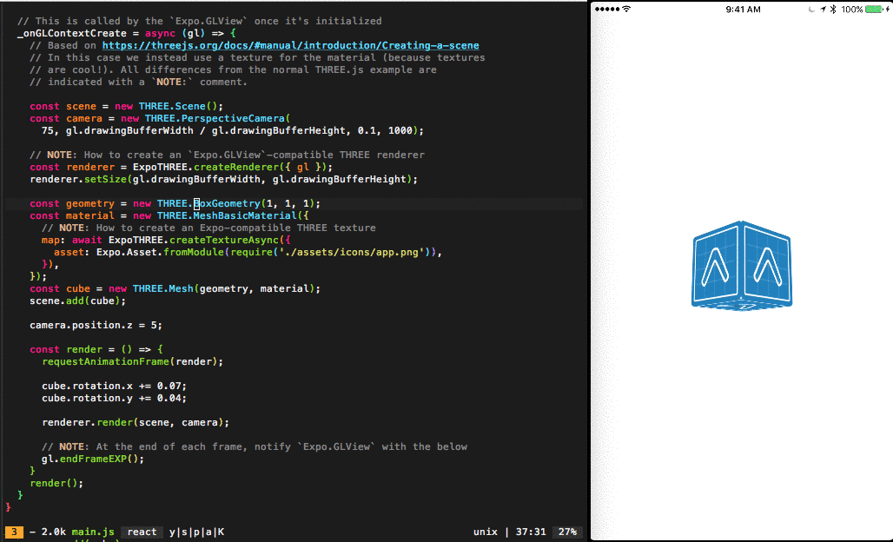

*NOTE: GIF above looks choppy because it's a GIF, the real thing is smooth, I promise...*

# expo-three

Use [THREE](https://threejs.org) on [Expo](https://expo.io)! Just `npm i -S
three expo-three` in your Expo project and import it with `import ExpoTHREE from
'expo-three';`.

## Functions

### `ExpoTHREE.createRenderer({ gl, ...extras })`

Given a `gl` from
an [`Expo.GLView`](https://docs.expo.io/versions/latest/sdk/gl-view.html),
return
a [`THREE.WebGLRenderer`](https://threejs.org/docs/#api/renderers/WebGLRenderer)
that draws into it.

### `ExpoTHREE.createTextureAsync({ asset })`

Given an [`Expo.Asset`](https://docs.expo.io/versions/latest/sdk/asset.html),
return a
([`Promise`](https://developer.mozilla.org/en-US/docs/Web/JavaScript/Reference/Global_Objects/Promise) that
will resolve with
a) [`THREE.Texture`](https://threejs.org/docs/#api/textures/Texture) backed by
that asset as an image.

## Example

This is based
on
[https://threejs.org/docs/#manual/introduction/Creating-a-scene](https://threejs.org/docs/#manual/introduction/Creating-a-scene).

In
a
[new blank Expo project](https://docs.expo.io/versions/v17.0.0/guides/up-and-running.html),
run `npm i -S three expo-three` to install THREE and ExpoTHREE. Then replace
`main.js` with the following:

```js
import Expo from 'expo';
import React from 'react';
import { StyleSheet, Text, View } from 'react-native';

import * as THREE from 'three';
import ExpoTHREE from 'expo-three';

export default class App extends React.Component {
  render() {
    // Create an `Expo.GLView` covering the whole screen, tell it to call our
    // `_onGLContextCreate` function once it's initialized.
    return (
      <Expo.GLView
        style={{ flex: 1 }}
        onContextCreate={this._onGLContextCreate}
      />
    );
  }

  // This is called by the `Expo.GLView` once it's initialized
  _onGLContextCreate = async (gl) => {
    // Based on https://threejs.org/docs/#manual/introduction/Creating-a-scene
    // In this case we instead use a texture for the material (because textures
    // are cool!). All differences from the normal THREE.js example are
    // indicated with a `NOTE:` comment.

    const scene = new THREE.Scene();
    const camera = new THREE.PerspectiveCamera(
      75, gl.drawingBufferWidth / gl.drawingBufferHeight, 0.1, 1000);

    // NOTE: How to create an `Expo.GLView`-compatible THREE renderer
    const renderer = ExpoTHREE.createRenderer({ gl });
    renderer.setSize(gl.drawingBufferWidth, gl.drawingBufferHeight);

    const geometry = new THREE.BoxGeometry(1, 1, 1);
    const material = new THREE.MeshBasicMaterial({
      // NOTE: How to create an Expo-compatible THREE texture
      map: await ExpoTHREE.createTextureAsync({
        asset: Expo.Asset.fromModule(require('./assets/icons/app-icon.png')),
      }),
    });
    const cube = new THREE.Mesh(geometry, material);
    scene.add(cube);

    camera.position.z = 5;

    const render = () => {
      requestAnimationFrame(render);

      cube.rotation.x += 0.07;
      cube.rotation.y += 0.04;

      renderer.render(scene, camera);

      // NOTE: At the end of each frame, notify `Expo.GLView` with the below
      gl.endFrameEXP();
    }
    render();
  }
}
````
